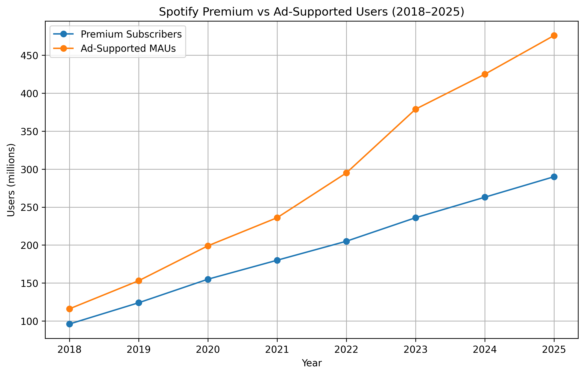
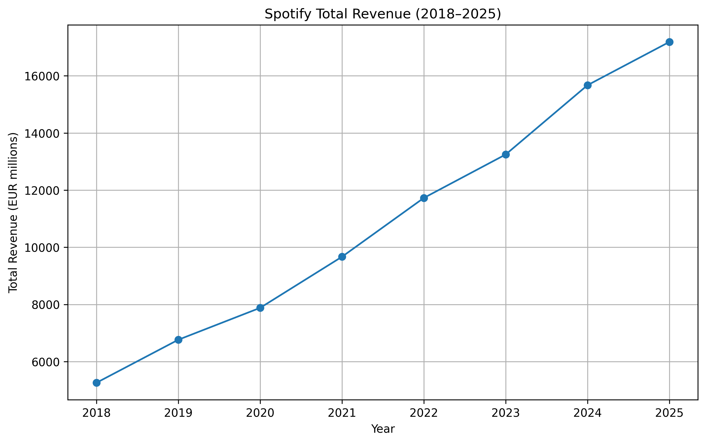
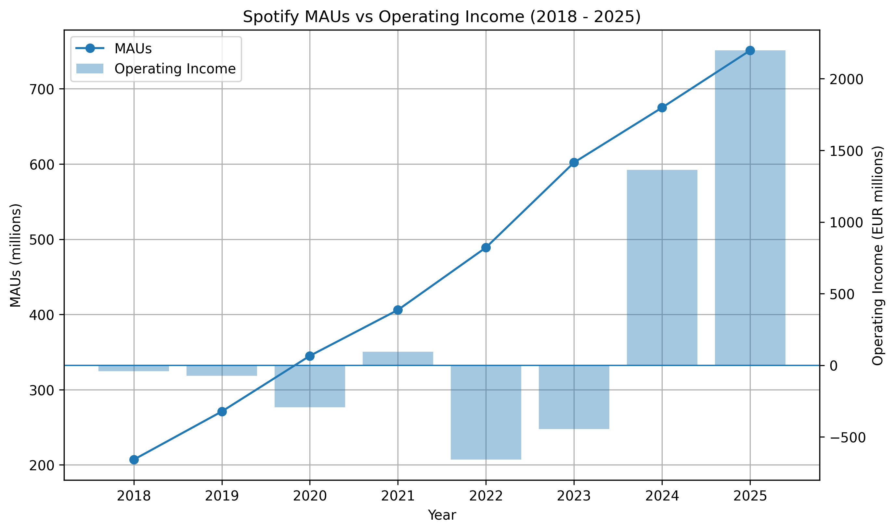
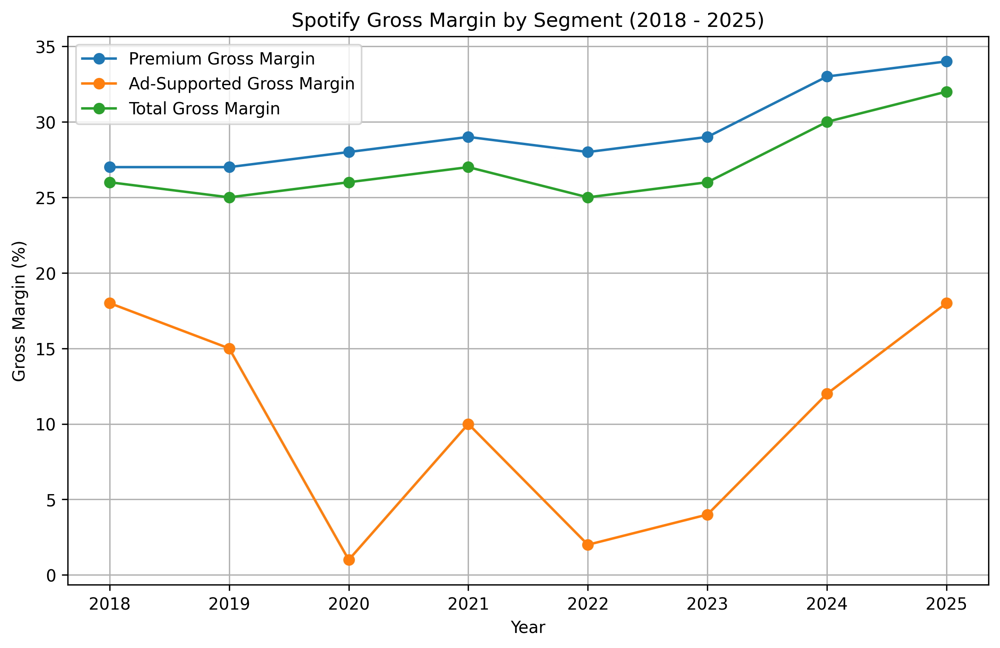
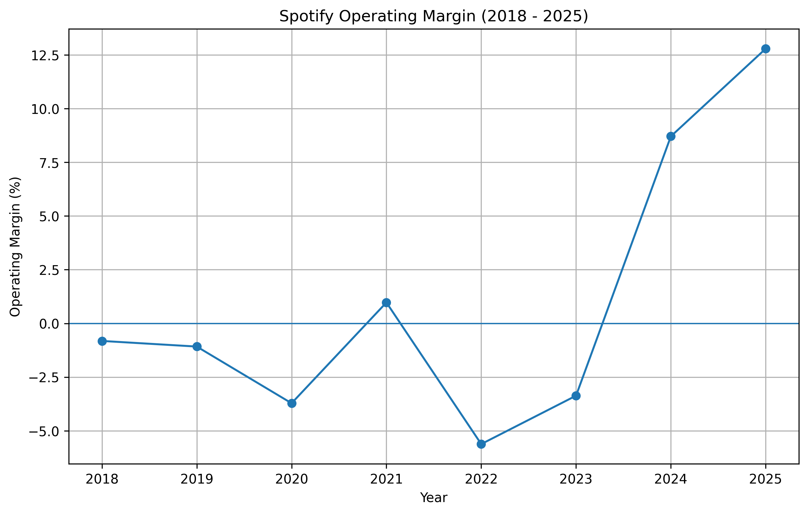
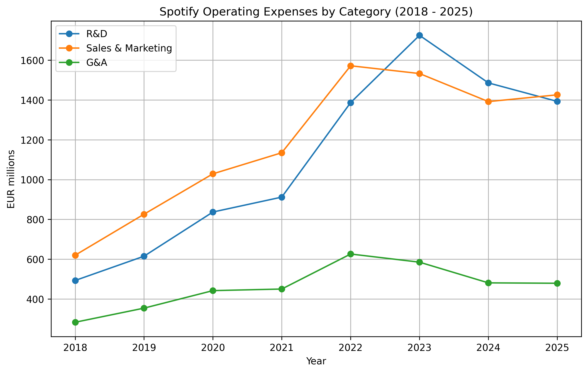
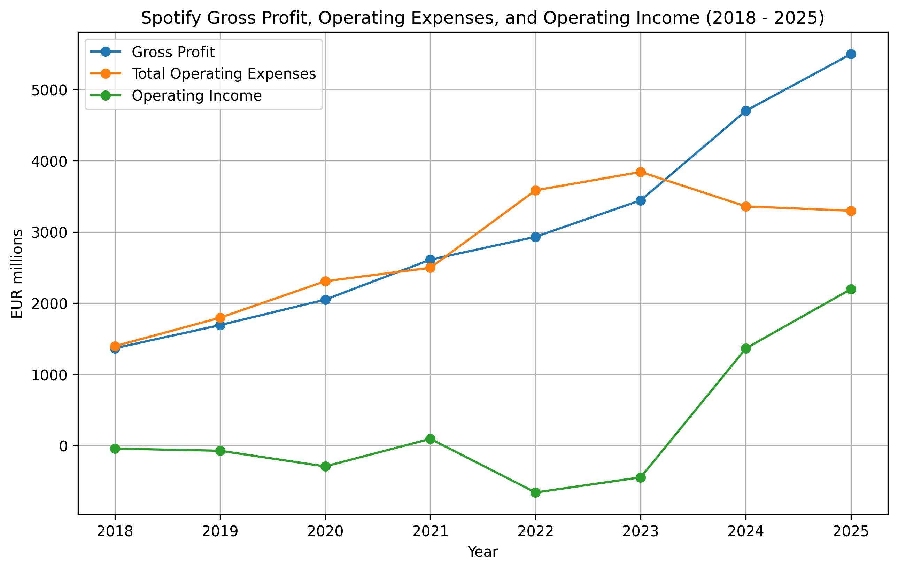

# How effectively has Spotify converted audience growth into operating profitability from 2018 to 2025?

## Executive Summary
This project explores how Spotify effectively converted its audience growth into an operating profitability in the last two years (2024 and 2025), despite experiencing inconsistent operating income in the earlier years following its IPO in 2018. 

The analysis shows that while Spotify had experienced steady user growth, revenue and gross proft margins from 2018 to 2025, its operating expenses increased faster than its gross profit, resulting in negative operating income. Consequently however, the years 2024 and 2025 marked a turning point whereas operating expenses stabilised and finally led to decrease therefore paving way for operating operating profitability.

Tableau Dashboard: https://public.tableau.com/app/profile/ayaz.alpaca/viz/spotify_audience_growth_to_operating_profitability/SpotifyAudienceGrowthtoOperatingProfitability

## Business Context
Spotify is a leading music streaming service which offers users premium and free subscriptions plans, to access a vast library of music and podcasts. The company has achieved growth in its user base, both premium and free, after its IPO in 2018. However, despite this growth, it did not necessarily translate into consistent operating profitability. This project aims to explore the effectiveness of Spotify's conversion into operating profitability from 2018 to 2025. 

## Initial Findings
To be frank, I did not start this project with a fully formed research question / topic. I merely picked Spotify as a company since I wanted to mix my interest in music, data analysis, and business. While gathering raw data for Spotify from its 2018 - 2025 financial reports, I found that the company has experienced growth in its user base, with an increase in both premium and free subscribers. However despite this growth, Spotify's operating income did not follow a smooth upward trend that usually follows when revenue growth is consistent. This initial observation therefore sparked my interest to explore the relationship further, which leads us to the hypothesis and analyses.

## Hypothesis
Spotify's audience growth from 2018 to 2025 has improved its revenue base, but the company's ability to convert into operating profitability depended on its gross margin and operating expenses. This suggests that while Spotify has been effective at expanding and monetising its user base, their main challenge is whether gross profit could grow faster than operating expenses.

# Metrics & Methodology

## Metrics Used
### Monthly Active Users (MAUs)
This metric represents the total number of unique users who have engaged with Spotify's platform at least once in a given month. It includes both premium subscribers and ad-supported users.

### Premium subscribers
This metric shows the number of users who have subscribed to Spotify's premium service, which offers ad-free listening and additional features.

### Ad-supported MAUs
This indicates the number of user accounts that access Spotify's services through the free, ad-supported tier. Users of this tier regularly engage with the platform but do not contribute to revenue through subscriptions, instead generating income through advertising.

### Total revenue
This metric represents the the income generated from premium and ad-supported segments. 

### Gross margin 
This indicates the percentage of total revenue that remains after deducting direct costs. This metric is crucial for understanding how effectively Spotify is managing its costs in relation to its revenue.

### Operating income
This metric represents the profit or loss generated from Spotify's core business operations, after accounting for all operating expenses. It is a key indicator of the company's profitability and financial health.

## Methodology
This project uses an exploratory business performance analysis to examine how Spotify converted audience growth into its financial performance. 

The analysis begins by comparing Spotify's Monthly Active Users with operating income to identify the main business problem: audience growth increased steadily, while operating profitability remained inconsistent. From there, the analysis follows a funnel-inspired framework:

-> MAUs -> User Segments -> Revenue -> Gross Margin -> Operating Income

This framework is used to trace how Spotify's audience growth moves through its business model: 
- First: MAU growth is analysed to measure overall audience expansion. 
- Second:  Premium Subscribers and Ad-Supported MAUs are compared to understand whether growth came from paid users, free users, or both. 
- Third: Total revenue is examined to determine whether this audience growth translated into stronger monetisation. 
- Finally: Gross margin and operating income are analysed to evaluate whether Spotify was able to convert revenue growth into operating profitability.

# Findings
## Growth occured across both premium and ad-supported segements
Spotify's audience growth from 2018 to 2025 was driven by increases in both premium subscribers and ad-supported users. This indicates that Spotify was successful in expanding its user base across both segments, attracting both paying customers and free users.

This is important becaue Spotify's business model relies on both premium subscriptions and ad-supported revenue. Premium users provide a steady stream of subscription revenue whereas ad-supported users generate income through advertising.

## Revenue increased alongside audience growth
Spotify's total revenue increased significantly from 2018 to 2025, which suggests that the compant was able to monetise its growing audience. 

However, revenue growth alone does not necessarily indicate profitability, as it is important to consider the costs associated with generating that revenue. Therefore, while Spotify's revenue growth is a positive sign, it does not guarantee that the company was able to convert this growth into operating profitability.

## Operating income remained inconsistent despite growth
Despite the growth in both audience and revenue, Spotify's operating income remained inconsistent from 2018 to 2025 with several years of operating losses. This suggests that while Spotify was able to increase its revenue and MAUs, the company did not automatically see positive operating profitability.

However, operating income improved in recent years, turning positive in 2024 and 2025 (and briefly in 2021). This suggests that Spotify's ability to convert audience growth into operating profitability may have depended by factors beyond revenue growth alone, such as gross margin control and operating expense control.

# Analyses
## Gross margin improved, but did it translate well into positive operating income?
Gross margin indicates how much revenue is left after deducting direct costs. This is worth noting because if revenue increases, then Spotify still needs enough gross profit to cover its operating expenses in order to acieve operating profitability.

## Revenue growth did not immediately translate into operating income
Operating margin is calculated by operating income divided total revenue. This metric is important because it shows how much of each euro of revenue is converted into operating profit. Despite Spotify's growth in users, revenue, and improving gross margin; operating margin remained negative throughout most of the period. However, operating margin improved during 2024 to 2025, which could suggest that Spotify's ability to convert revenue growth into operating profability by means of controlled gross margins and increased effectiveness of operating expenses, had paid off. 

The next section examines whether operating expenses could explain the gap between gross profit and operating income.

## Operating expenses explain the gap between gross profit and operating income
After gross profit, Spotify still needs to cover operating expenses such as research and development, sales and marketing, and general and administrative costs. These expenses help explain why revenue growth and improving gross margin did not immediately result in consistent operating profitability.

The operating expense breakdown shows that Spotify's major operating expenses increased from 2018 to 2023. Sales and marketing was one of the largest expense categories for much of the period, while research and development increased sharply and reached its highest point in 2023. This suggests that Spotify continued investing heavily in user growth, product development, and platform expansion.

However, operating expenses decreased or stabilised in 2024 and 2025, while gross profit continued to increase. This created a wider gap between gross profit and total operating expenses, allowing Spotify to turn operating income positive in 2024 and 2025.

